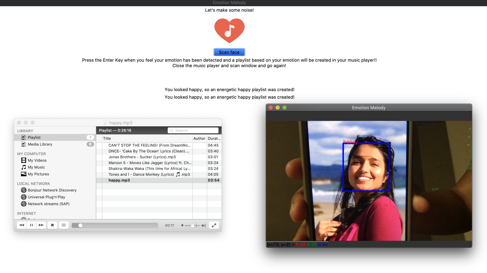

# Emotion-Melody

This real-time Emotion detecting Music Player is an application made using various libraries of Python such as Keras, tensorflow, opencv, Tkinter, pandas and numpy.
It opens an opencv window that uses webcam and lets the users scan their faces and hit enter, upon which any local music player will open with a playlist created   based on the emotion it detected. 
Program is trained for 50 epochs and runs at 60% accuracy. (You can change the number of epochs in emotion-detection.py)

# Dependencies:
    pip install numpy
    pip install pandas
    pip install tensorflow
    pip install keras
    pip install opencv-python
    pip install Tkinter

    Download kaggle dataset fer2013.csv from here => https://www.kaggle.com/c/challenges-in-representation-learning-facial-expression-recognition-challenge/data
      --- Put the fer2013.csv file in your folder
    Download your favourite songs and put them in respective folders. For example, a happy song will go in songs/happy

# Usage
    Run emotion-detection.py => python3 emotion-detection.py
      --- This should create fer.h5 and fer.json in your folder. Training session might take several hours. 
    Then run emotion-melody.py to open a tkintrer window
